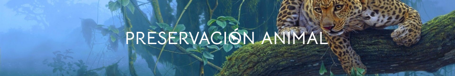
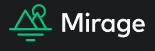

<header  align="center">

<h2  align='center'>Este es un proyecto de la comunidad:</h2>

<div  align='center'><a  href="https://www.nocountry.tech/"  target="_blank">


</a>

</div>

<hr>

<!-- PROJECT LOGO -->

<a  href="https://github.com/No-Country/c14-22-ft-java-react"  target="_blank">



</a>

<hr>

<h1  align='center'>Bienvenid@s a Preservacion Animal</h1>

</header>

<section  id='intro'>

<p  align='center'><strong>Plataforma de Preservación Animal Silvestre en Latinoamérica</strong></p>

<hr>

<p> Descubre una manera única de contribuir a la preservación de la vida silvestre en Latinoamérica con Preservación Animal, una iniciativa que va más allá de la conservación tradicional. Nos enorgullece presentar un proyecto innovador que combina la pasión por la vida silvestre con oportunidades tangibles para marcar la diferencia.

</p>

<div  align='center'>

<a  href="https://c15-57-ft-react-agregarback.vercel.app/"  target="_blank">


</a>

<a  href="https://www.figma.com/file/u0zUDwyfM5xFLVzLqtyrlr/No-Country"  target="_blank">


</a>

<a  href="https://github.com/No-Country/c15-57-ft-react-agregarback/issues"  target="_blank">


</a>

</div>

</section>

<hr><!-- TEAMS -->

  

<h2> Equipo ( c15-57-ft-react-agregarback ) </h2>

  

<table  align='center'>

<tr>

<td  align='center'>

<div >

<a  href="https://github.com/angelbcdev"  target="_blank"  rel="author">


</a>

<a  href="https://github.com/angelbcdev"  target="_blank"  rel="author">

<h4  style="margin-top: 1rem;">Angel Bernechea</br><small>Front-End</small></h4>

</a>

<div  style='display: flex; flex-direction: column'>

<a  href="https://github.com/angelbcdev"  target="_blank">


</a>

<br>

<a  href="https://www.linkedin.com/in/angel-bernechea/"  target="_blank">


</a>

</div>

</div>

</td>

<td  align='center'>

<div >

<a  href="https://github.com/Natsumychan"  target="_blank"  rel="author">


</a>

<a  href="https://github.com/Natsumychan"  target="_blank"  rel="author">

<h4  style="margin-top: 1rem;">Diana Castaño</br><small>Front-End</small></h4>

</a>

<div  style='display: flex; flex-direction: column'>

<a  href="https://github.com/Natsumychan"  target="_blank">


</a>

<br>

<a  href="https://www.linkedin.com/in/diana-castaño-zapata-aba84284/"  target="_blank">


</a>

</div>

</div>

</td>

<td  align='center'>

<div >

<a  href="https://github.com/FabioDrizZt"  target="_blank"  rel="author">


</a>

<a  href="https://github.com/FabioDrizZt"  target="_blank"  rel="author">

<h4  style="margin-top: 1rem;">Fabio D. Argañaraz</br><small>Front-End</small></h4>

</a>

<div  style='display: flex; flex-direction: column'>

<a  href="https://github.com/FabioDrizZt"  target="_blank">


</a>

<br>

<a  href="https://www.linkedin.com/in/fabiodrizzt/"  target="_blank">


</a>

</div>

</div>

</td>

</tr>

</table>

  

<table  align='center'>

<tr>

<td  align='center'>

<div >

<a  href="https://github.com/JornabeDV"  target="_blank"  rel="author">


</a>

<a  href="https://github.com/JornabeDV"  target="_blank"  rel="author">

<h4  style="margin-top: 1rem;">Jorge Beja</br><small>Front-End</small></h4>

</a>

<div  style='display: flex; flex-direction: column'>

<a  href="https://github.com/JornabeDV"  target="_blank">


</a>

<br>

<a  href="https://www.linkedin.com/in/jorge-nahuel-beja-rosa/"  target="_blank">


</a>

</div>

</div>

</td>

<td  align='center'>

<div >

<a  href="https://github.com/JRIVERADDIAZ"  target="_blank"  rel="author">


</a>

<a  href="https://github.com/JRIVERADDIAZ"  target="_blank"  rel="author">

<h4  style="margin-top: 1rem;">Jovahin Rivera</br><small>Front-End</small></h4>

</a>

<div  style='display: flex; flex-direction: column'>

<a  href="https://github.com/JRIVERADDIAZ"  target="_blank">


</a>

<br>

<a  href="https://www.linkedin.com/in/jovahin-abraham-rivera-diaz-8559bb110/"  target="_blank">


</a>

</div>

</div>

</td>

  

</tr>

</table>

  

<table  align='center'>

<tr>

<td  align='center'>

<div >

<a  href="https://www.linkedin.com/in/emmanuel-páez-620692215"  target="_blank"  rel="author">


</a>

<a  href="https://www.linkedin.com/in/emmanuel-páez-620692215"  target="_blank"  rel="author">

<h4  style="margin-top: 1rem;">Emmanuel Páez</br><small>Diseñador UX/UI</small></h4>

</a>

<div  style='display: flex; flex-direction: column'>

<a  href="https://www.linkedin.com/in/emmanuel-páez-620692215"  target="_blank">


</a>

</div>

</div>

</td>

<td  align='center'>

<div >

<a  href="https://www.linkedin.com/in/carolinanin-uxuidesign"  target="_blank"  rel="author">


</a>

<a  href="https://www.linkedin.com/in/carolinanin-uxuidesign"  target="_blank"  rel="author">

<h4  style="margin-top: 1rem;">Carolina Nin</br><small>Diseñador UX/UI</small></h4>

</a>

<div  style='display: flex; flex-direction: column'>

<a  href="https://www.linkedin.com/in/carolinanin-uxuidesign"  target="_blank">


</a>

</div>

</div>

</td>

</tr>

</table>

<hr>

  

<!-- ABOUT THE PROJECT -->

<section>

<h2>


<span>Acerca del Proyecto</span>

</h2>

<p><strong>Preservación Animal</strong> no es solo un proyecto; es un compromiso con la preservación de la biodiversidad en Latinoamérica. Nuestra plataforma ofrece una experiencia integral que incluye la venta de merchandising exclusivo, donaciones directas y oportunidades de voluntariado. Estamos aquí para brindarte una manera sencilla y significativa de contribuir al bienestar de la fauna silvestre mientras participas activamente en la protección de su hábitat.

</p>

  

<h2>Descubre cómo puedes ser parte del cambio:</h2>

  

<ol>

<li><strong>Merchandising Exclusivo:</strong>

Explora nuestra tienda en línea y descubre una variedad de productos exclusivos. Desde camisetas y gorras hasta artículos de decoración, cada compra contribuye directamente a proyectos de conservación.

<li><strong>Donaciones Directas:</strong>

Tu generosidad importa. Realiza donaciones directas a proyectos específicos de preservación animal. Cada contribución cuenta y ayuda a financiar acciones concretas para proteger la vida silvestre.

<li><strong>Voluntariado en Acción:</strong>

Únete a nuestro programa de voluntariado y vive la experiencia única de trabajar directamente en proyectos de conservación. Desde la liberación de animales rehabilitados hasta la restauración de hábitats, tu participación marca la diferencia.

<li><strong>Ecoviajes:</strong>

Estos viajes no solo serán experiencias únicas, sino que también les permitirán sumergirse en la belleza y fragilidad de nuestros diversos ecosistemas, creando recuerdos que durarán toda la vida.

</ol>

</section>

  

<hr><!-- TECH STACK -->

<section  id='tech-stack'>

<h1> Tecnologias Usadas </h1>

<h2>Front-End</h2>

  


  

<h3>Back-End</h3>

<a  href='https://github.com/No-Country/c15-57-ft-react-agregarback/blob/main/src/Store/Server/MirageConf.js'>



</a>

<h2> Organización </h2>

<a  href='https://figma.com/'>


</a>

<a  href='https://slack.com/'>


</a>

<a  href='https://www.discord.gg/'>


</a>

</section>

  

<hr><!-- GETTING STARTED -->

<h1> Comenzando </h1>

  

A continuación, te proporcionaremos las instrucciones para instalar y utilizar nuestro sistema, desarrollado con React.

  

<h2> Requisitos previos</h2>

Asegúrate de tener instalado Node.js en tu máquina antes de comenzar. Puedes descargarlo desde <a  href='https://nodejs.org'> aquí </a>.

  

<h2>Pasos de instalación</h2>

  

Clonar repositorio

  

```sh

git  clone  https://github.com/No-Country/c15-57-ft-react-agregarback

```

  

Instalar dependencias

  

```sh

npm  install

```

  

Correr el proyecto

  

```sh

npm  run  dev

```

  

O simplemente clickea en el link de

<a  href="https://c15-57-ft-react-agregarback.vercel.app/"  target="_blank">Ver Demo.</a>

  

<!-- USAGE EXAMPLES -->

<h1> Uso </h1>

  

Una vez que hayas completado los pasos de instalación, puedes comenzar a utilizar la plataforma de Preservación Animal - Latinoamérica siguiendo estos pasos:

  

<h2> Registro: </h2>

  

Abre tu navegador y ve a http://localhost:3000.

Regístrate en nuestro portal proporcionando la información necesaria.

  

<h2>Inicio de sesión:</h2>

Después de registrarte, inicia sesión con tu correo electrónico y contraseña.

  

<h2>Gestión del negocio:</h2>

Explora las diversas secciones de la plataforma para gestionar productos, realizar un seguimiento de transacciones internas y recibir notificaciones y alertas importantes.

  

<h2>Comprométete:</h2>

Participa activamente comprando merchandising exclusivo, realizando donaciones, inscribiéndote como voluntario o planificando tu próximo ecoviaje.

Recuerda que tu participación es fundamental para el éxito de nuestro proyecto. ¡Gracias por unirte a nosotros en esta noble causa!

  

Si encuentras algún problema durante la instalación o uso, no dudes en contactarnos a través de nuestro soporte técnico en <a  href='mailto:support@preservacion-animal-latam.com'> support@preservacion-animal-latam.com.</a> ¡Juntos hacemos la diferencia!

  

<!-- Video -->

<h2> Video </h2>

<p> Coming soon... </p>

<!-- ACKNOWLEDGMENTS -->

  

<div  align='center'>

<h3>Agradecimientos</h3>

<a  href="https://www.nocountry.tech/"  target="_blank">


</a>

</div>